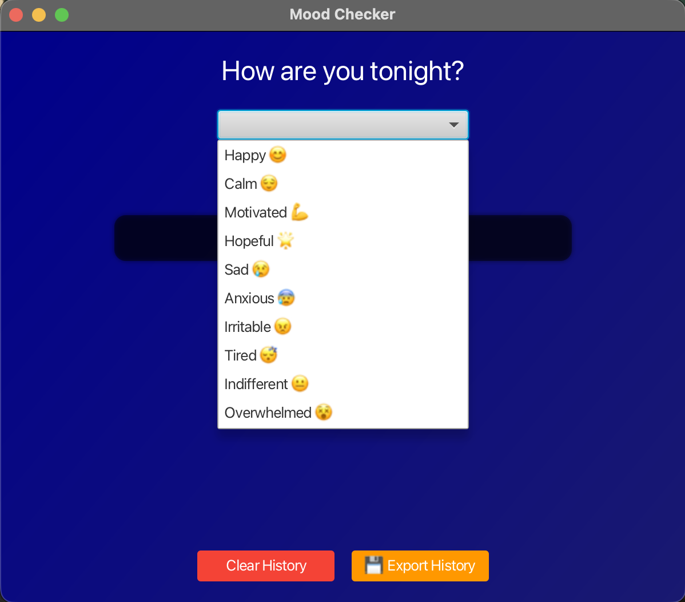
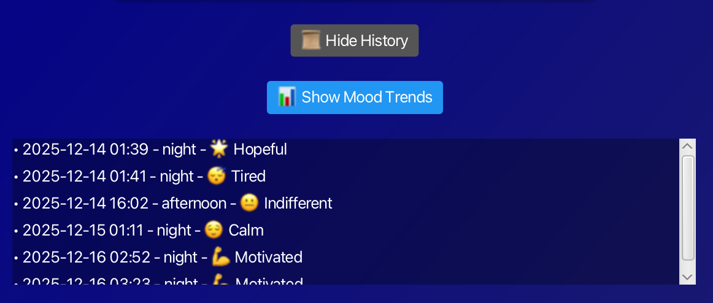
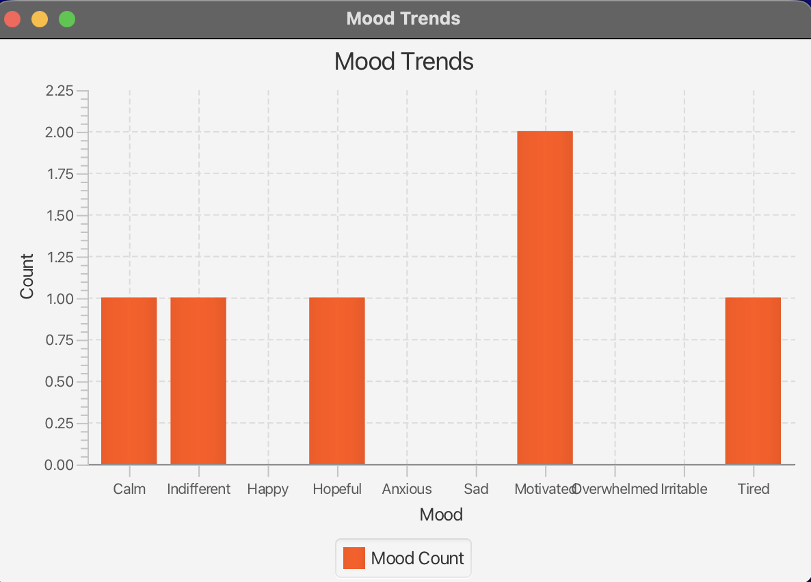
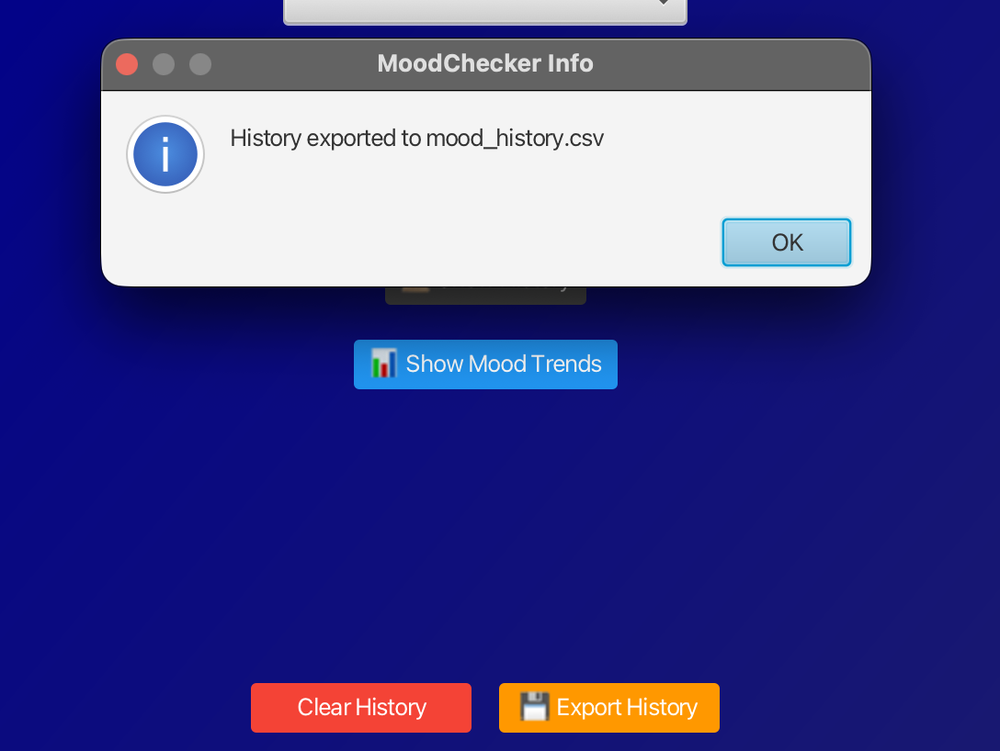

# MoodApp

**MoodApp** is a JavaFX application that helps users track and visualize their emotions throughout the day. It provides personalized responses based on your mood, maintains a color-coded mood history, and allows you to view trends or export your data.

---

## Features

- Select your current mood from a dropdown menu.
- Receive a personalized response based on the time of day.
- View a history of past moods, color-coded for quick reference.
- Toggle the history view on and off.
- Visualize mood trends in a bar chart.
- Export mood history as a CSV file.

---

## Requirements

- Java 17 or later
- Maven
- JavaFX SDK
- IntelliJ IDEA or another Java IDE (optional, but recommended)

---

## Getting Started

### Clone the Repository

git clone <your-repo-url>

cd MoodApp,

### Run the App:
mvn clean javafx:run

### Project Structure
moodchecker/ — Main application and UI controller

service/ — Business logic and mood responses

repository/ — Save/load mood history

analytics/ — Mood trends visualization

model/ — Enum for emotions

util/ — Time-of-day utilities

----
## Screenshots

### Main Screen with Greeting and Mood Dropdown

### Submit Mood Result with Color Feedback

### Color-Coded History

### Mood Trends Chart

### CSV Export Confirmation

### How to Run in an IDE
Open the project in your IDE (IntelliJ, Eclipse, etc.).

Ensure JavaFX is properly configured.

Run MoodApp.java (or MyMoodApp.java depending on your version).

The GUI should launch, ready to track moods.

### Future Improvements
Track mood trends over weeks or months.

Multi-user support with login.

Use JSON storage instead of plain text.

Add subtle UI animations and modern styling.

